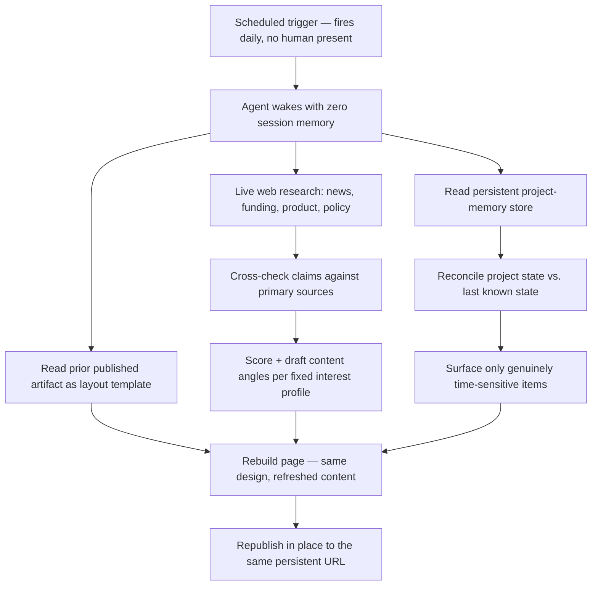

# Command Centre — Autonomous Daily Briefing System

A scheduled AI agent that runs unattended every morning, pulls from live web
research and a persistent memory store, and republishes a single
always-current dashboard — no manual trigger, no accumulating log, no stale
data.

**Live discipline, not a one-off script.** Most "AI dashboard" demos are a
single generation run. This one is designed to run *every day, forever,
without a human watching it fire* — which changes the engineering problem
entirely: every section has to define what "fresh" means, what counts as a
full replace vs. an accumulating log, and what to do when a data source
fails silently instead of erroring loudly.

## What it does

Each morning, a scheduled task wakes an agent with no memory of any prior
run except what's in the persistent store. It:

1. **Rebuilds a live news + market-intel brief** — searches for the day's
   top AI/tech stories and macro market movements (funding, acquisitions,
   product launches, policy), verifies details against primary sources
   (not just search snippets), and drafts short-form content angles scored
   against a fixed set of interest areas.
2. **Syncs a project-pipeline view from long-term memory** — reads a set of
   persistent project files (each one an ongoing thread: status, blockers,
   next action, priority), reasons about what's changed since the last run,
   and surfaces the handful of items that are genuinely time-sensitive
   *today* — not a static todo list, a recomputed one.
3. **Publishes to one persistent artifact** — the whole thing rebuilds and
   republishes in place to the same URL every run, rather than posting a
   new document each day. The previous day's version is the template: the
   agent reads its own prior output before rebuilding it, so layout and
   design stay stable while content refreshes underneath.

*(This public build omits a fourth module — a verified-remote-job scout
that cross-checks postings across ~28 job boards — since it depends on the
live source landscape and isn't the interesting engineering problem here.)*

## Why this is harder than it looks

- **Full replace, not append.** A naive version of this just keeps writing
  new entries forever. Every section here is explicitly scoped as "what's
  true right now," which means the agent has to actively decide what to
  drop, not just what to add.
- **Verify before publish, not verify-if-convenient.** Web research gets
  cross-checked against primary sources before it lands in the brief —
  search-result snippets alone are treated as leads, not facts.
- **Memory as the source of truth for personalization, not a prompt
  stuffed with context.** The pipeline section doesn't work off anything
  passed in at run time — it reads a structured, ever-updated memory store
  and has to reconcile what's changed, stale, or resolved since the last
  read, the same problem any long-running agent has once a "session" stops
  being a useful unit of time.
- **Fails loud, not silent.** When a research pass comes up thin or a
  source can't be reached, that's surfaced in the output rather than
  quietly producing a shorter brief that looks complete.

## Architecture

## Stack

- **Orchestration:** a scheduled agent task (cron-style trigger → fresh
  agent session → structured multi-step run)
- **Research:** live web search + targeted page fetches, with a
  verify-before-include discipline rather than trusting snippets
- **State:** a persistent, structured memory store (one file per ongoing
  project/thread), read and reconciled fresh every run
- **Output:** a single self-contained HTML/CSS/JS page, republished in
  place to a stable URL on every run

## Note on this repo

This is a **sanitized public write-up** of a personal production system.
The live version tracks real project pipelines with real figures, client
names, and negotiation details — none of that belongs in a public repo, so
`example-output.html` in this repo uses illustrative placeholder data in
the Pipeline tab. The Content Ideas and Market Intel tabs are genuine,
unedited output from a real run (they're built from public news, so
there's nothing to redact).

## Status

Running daily in production since September 2026. Part of a portfolio of
eval-first AI builds — see the sibling repos for the RAG knowledge base
and invoice-reconciliation eval harness this same practice produced.
